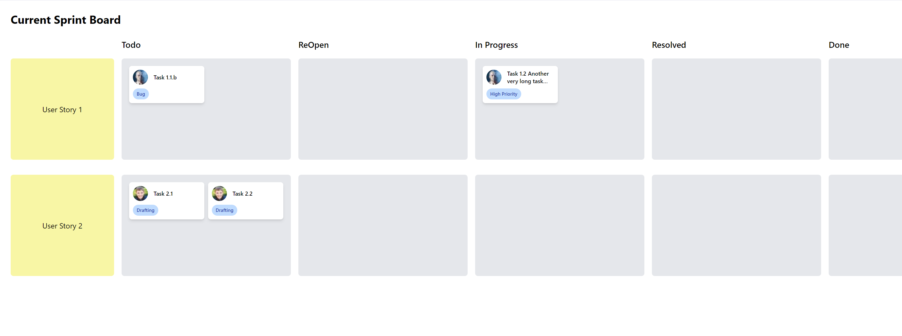

# Scrum Board - React DnD

This project is an open-source Scrum board application, inspired by the traditional sprint board. The application is built using React, leveraging the powerful React DnD library to create an intuitive drag-and-drop experience for managing tasks within user stories across different stages of a sprint.



## Features

- **User Stories and Tasks**: Organize work into user stories, each containing multiple tasks.
- **Dynamic Columns**: Tasks can be moved between the following columns:
    - Todo
    - ReOpen
    - In Progress
    - Resolved
    - Done
- **Drag and Drop**: Easily move tasks across different columns using an intuitive drag-and-drop interface.
- **Task Metadata**: Each task can have an assignee and tags for easy categorization.

## Technology Stack

- **React**: The main framework for building the user interface.
- **React DnD**: For handling drag-and-drop interactions.
- **TypeScript**: Ensures type safety and robustness during development.
- **HTML5 Backend**: Used with React DnD to support drag-and-drop actions.
- **CSS**: Styling is done using standard CSS classes and some inline styles for layout consistency.

## Getting Started

### Prerequisites

Ensure you have **Node.js** and **npm** (or **yarn**) installed.

### Installation

1. Clone the repository:
   ```sh
   git clone https://github.com/trong292990/scrum-board-react.git
   cd scrum-board-react
   ```

2. Install the dependencies:
   ```sh
   npm install
   # or
   yarn install
   ```

### Running the App

To start the development server:

```sh
npm run dev
# or
yarn dev
```

The app will be available at `http://localhost:5173`.

### Usage

- **Add Tasks**: Each user story contains a set of tasks.
- **Drag & Drop**: Click and drag tasks between columns to update their status.

## Project Structure

- `src/`
    - `components/` - Contains all the components used in the application.
    - `App.tsx` - Main entry point where the sprint board is created.
    - `App.css` - Basic styling for the board.

## License

This project is licensed under the **MIT License**. Feel free to use, modify, and distribute it as per the terms of the license.

## Acknowledgements

- Thanks to the [React DnD](https://react-dnd.github.io/react-dnd/about) team for creating such a flexible drag-and-drop library.
- [Pravatar](https://i.pravatar.cc) for providing random profile pictures used for the task assignees.

